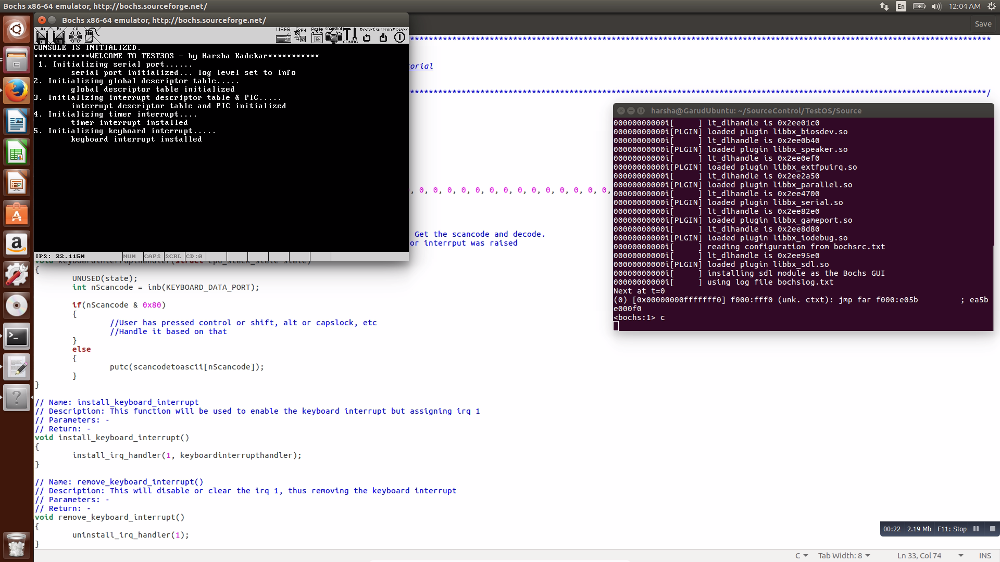

# OSDev
This will have all the code related to OS Developement
This is the single repository where all the OS related work will be stored.

Here is the folder structre - 

1. Gyaan - Here I will have any documents related to Operating system. It can be written by me or got from some other source.

2. OtherOS - It will have any other OS which I am referencing for my development or other OS aprt from TestOS series which I develop examplement initial PLPOS development.

3. TestOS - This is the one which will house all my OS development. It will have series of folders like Test1OS, Test2OS, Test3OS... Now each incremental series indicates new knowledge which I acquired about OS and each OS will be higher version than previous.

Current OS development is Test3OS.

It is a basic kernel similar in architecture to Linux kernel. It is targeted for x86 architecture. 

Demo - 

Plan is to develop following things - 

1. Process Management
2. Memory Management
3. Thread Management
4. Process and Thread synchronization
5. Device Management
6. File System
7. Multiple process and thread
8. Graphical user interface

As of now it has only kernel space with segmentation.It has a generalized interrupt service routine. It has a timer. It can interact with console and keyboard. Paging development is going on.
